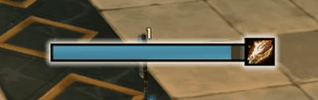
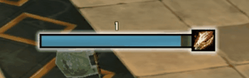
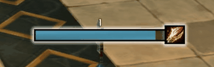
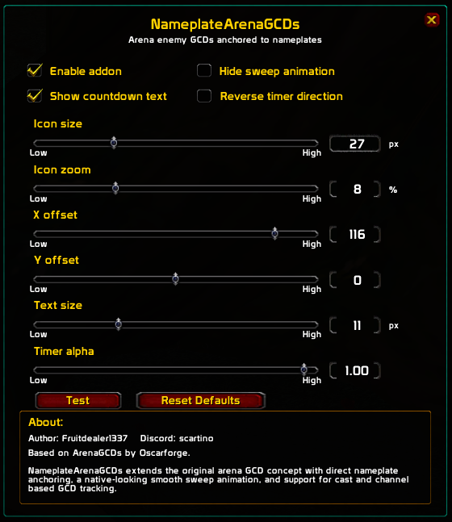

# NameplateArenaGCDs

NameplateArenaGCDs is a lightweight addon for World of Warcraft 3.3.5a / WotLK that displays enemy arena global cooldowns directly on their nameplates.

The addon is based on **ArenaGCDs by Oscarforge**, but extends the original concept with direct nameplate anchoring, a native-looking smooth sweep animation, and support for GCD tracking from instant spells, casts, and channels.

It is designed mainly for arena gameplay, where tracking enemy globals directly on nameplates can make cooldown awareness much easier without needing to look away from the fight.


**!!!THIS ADDON DOES NOT WORK IN THE OPEN WORLD!!!**

---

## Preview

### GCD states

<table>
  <tr>
    <td align="center"><strong>Normal GCD</strong></td>
    <td align="center"><strong>Cast GCD+cancel</strong></td>
    <td align="center"><strong>Channel GCD</strong></td>
  </tr>
  <tr>
    <td></td>
    <td></td>
    <td></td>
  </tr>
</table>

### Configuration



---

## Main Features

- Enemy arena GCD tracking directly on nameplates
- Supports instant spell GCDs
- Supports cast and channel based GCDs
- Fake casts and canceled casts can clear the tentative GCD display
- Smooth custom sweep animation

---

## Installation

1. Download the latest release.
2. Extract the folder.
3. Place `NamePlateArenaGCDs` into:

```text
World of Warcraft/Interface/AddOns/
```

4. Restart the game or reload your UI.
5. Open the GUI with:

```text
/npgcd
```

You can also open NameplateArenaGCDs from:

```text
Interface → AddOns → NameplateArenaGCDs
```

---

## Status

NameplateArenaGCDs is currently in **beta**.

The addon is stable enough for public testing, but bugs may still exist.

If you can reproduce a bug, please report it to me.


## SPECIAL BIG THANKS TO

**Asuri** 

for his testing of early builds, giving out feedback and ideas to implement.

Make sure to follow him across all of his platforms! He's an invaluable 3.3.5a creator! 

[](https://www.twitch.tv/AsuriTV) [](https://discord.gg/fkQDxPunG4) [](https://www.youtube.com/@AsuriTV)


